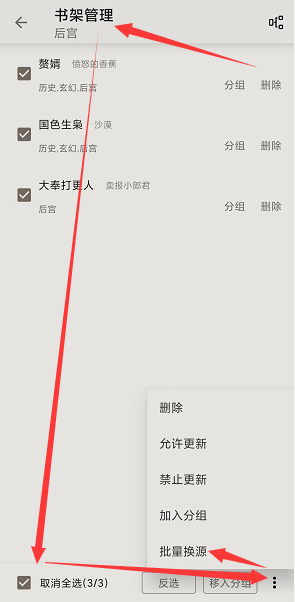
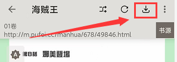
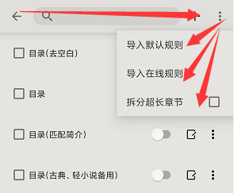

今天不闲聊了，就说说最近的更新。

当然主要还是选择一些大家可能会用到的功能上的更新给大家说一下：

## 添加所有书签

其实就是方便大家可以快速的去查看自己的书签，我觉得可以用来当做大家一直心心念念的批注或者划线的功能来使用。

批注或者划线的功能说实话目前因为换源定位问题非常难做的很好，大家先这样凑合用用吧。

## 添加批量换源

这个功能其实是为了方便大家如果发现了一个新的非常好用的源时，直接进行批量操作的，尤其是最近一段时间。

具体位置在书架右上角的【书架管理】中：

## 缓存导出包含图片类型

这个就是为漫画做的优化，大家碰到网速好的时候可以多多缓存一些漫画章节，甚至可以导出漫画。不过需要注意，漫画导出要把格式改成EPUB。

导出的位置在书架右上角【缓存/导出】，进入后可以在右上角菜单设置导出格式。

## TXT规则优化

这个主要是目录规则的优化。说实话TXT导入后其实并不像大家想的那么简单，觉得导入后必然能看，因为这玩意一个是编码种类繁杂，一个是制作者制作的并不规范，就导致大家可能会遇到各种问题。

市面上看TXT比较好的软件，多数优化所花费的时间和人力都不是我能比的，所以我也只能尽力而为。

目前我能做到的就是给大家添加了这个功能——【TXT目录正则】，具体位置在【我的】-【书源管理】中：

经常看TXT的，遇到目录区分问题的不妨试试这个功能。

## Web端阅读实现无限滚动

这个功能其实最方便的是使用我之前推荐的那个小技巧，不知道的可以点这里看看，绝对好使。

其他的基本都是一些细节和使用体验上的优化，以及BUG修复，就不多说了。