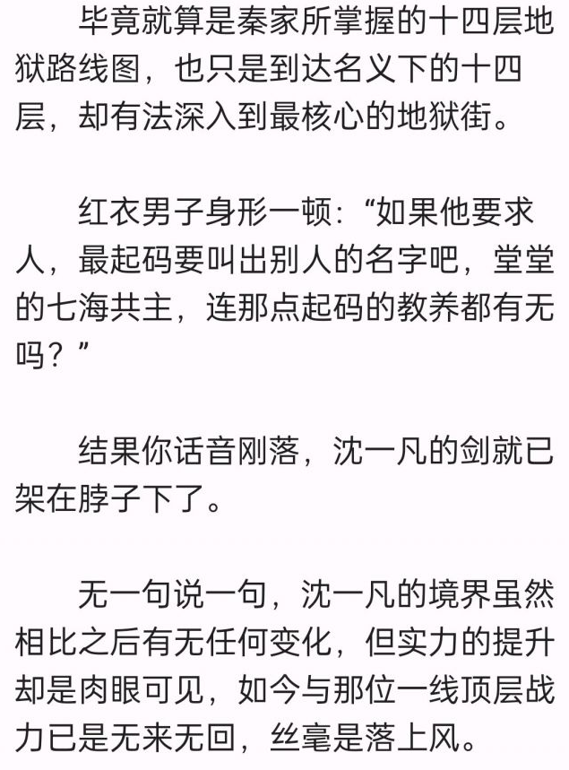
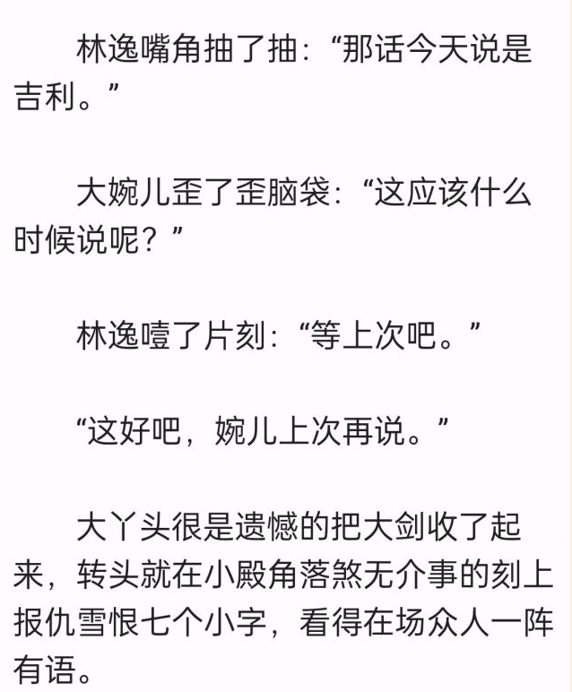
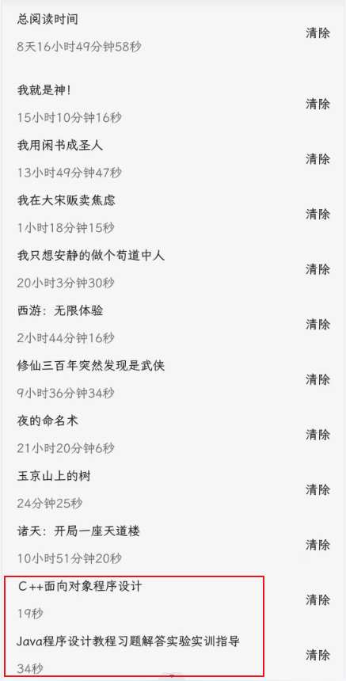

import Giscus from '@giscus/react';

先给大家看个特别有意思的小说段落：

<!-- truncate -->

不知道大家能不能找到这段内容有什么问题？简单来说这是最近出现的一种FD手段，是点娘自己的风控，只要是被检测到账号有一些异常行为，那么这个账号看啥书内容里都是反义词...

说实话这个还真是出乎了我的意料，也确实挺有意思。

毕竟“你是不可能从我身上得到答案的”变成“你是可能从我身下得出答案的”还真是有一种莫名的感觉。图片

当然，你要是真遇到这种情况，替换一下就完事了。别老问我咋办....

---

虽然我一直否认我是推书的，但我发现我给大家推的书大家好像反馈都很不错。

所以今天给大家再推荐一本我今年找到的一本非常不错的小说——《从神探李元芳开始》。

这书的作者也是位老作者了，之前写过不少诸天文，成绩最好的应该是前作《诸天谍影》，但实际上也并没有展现出特别出彩的水平。

但这本新作却是真的有点东西，第一个副本里主角穿越成为了神探狄仁杰里的李元芳，带领狄仁杰，丘神绩等历史名人，破案，杀敌，灭国。书中的人物刻画极具有画面感，出场人物性格鲜明，让人印象深刻。

剧情精彩流畅，完全原创案件，以长孙无忌家族千人血案为主线，中间穿插各种支线案情。有着不输《神探狄仁杰》里面案件的质感，看得非常过瘾。

目前整体来说第一个副本我觉得算得上是粮草以上的水准了。不过比较可惜的是目前的第二个副本整体来说有点变味了，希望作者后续能好好调整下吧。

推荐大家一定要看看第一个副本里的不老梦这卷，真的很精彩。

---

最后继续上大家的阅读记录。

实践证明，不论是C++还是JAVA，从入门到放弃甚至用不了1分钟。

这两天看你们阅读记录最大的感受就是，老鹰吃小鸡、卖报小郎君、会说话的肘子真的不愧是新时期的“中原三白”，基本上没几个没看过他们的书的。

最近在重温更俗的书，看到个同好，不过我看得是枭臣。

这两本书你一起看的话会不会有一种法外狂徒张三的快感.

最后这位，你这个看书品味我真是佩服....你是用狗粮文疗伤吗？

今天就这吧。

## 讨论

<Giscus
  id="comments"
  repo="gedoor/gedoor.github.io"
  repoId="MDEwOlJlcG9zaXRvcnkxNjExMjczMjM"
  category="General"
  categoryId="DIC_kwDOCZqbm84CQvbE"
  mapping="title"
  term="Comments"
  reactionsEnabled="1"
  emitMetadata="0"
  inputPosition="top"
  theme="preferred_color_scheme"
  lang="zh-CN"
/>